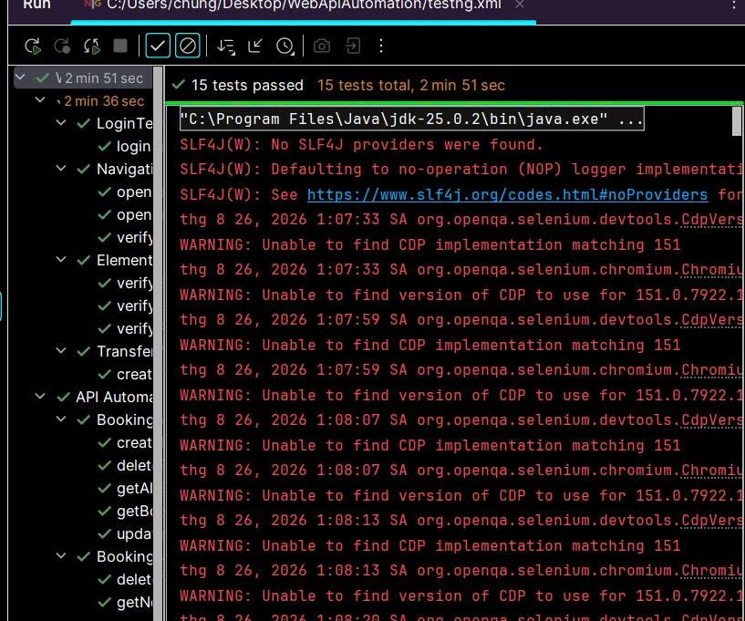

# Automation Test Report

## Project

Web & API Automation Testing Project

## Test Environment

- Operating System: Windows 11
- IDE: IntelliJ IDEA
- Java: JDK 25
- Build Tool: Maven
- Web Browser: Google Chrome
- Web Automation: Selenium WebDriver
- Test Framework: TestNG
- API Automation: REST Assured

## Applications Under Test

### Web

WorkDo Dash Demo

https://dash-demo.workdo.io

### API

Restful Booker

https://restful-booker.herokuapp.com

## Test Scope

The automation suite covers:

- Web navigation
- Login page element validation
- Demo authentication
- Purchase Transfer workflow
- REST API CRUD operations
- API negative testing

## Execution Result

| Result | Quantity |
|---|---:|
| Total Tests | 15 |
| Passed | 15 |
| Failed | 0 |
| Skipped | 0 |
| Pass Rate | 100% |

## Web Test Result

8 Web Automation test cases passed.

The advanced Web workflow automates:

Purchase → Transfers → Create Transfer

The workflow includes selecting warehouse information, product and quantity before submitting a transfer.

## API Test Result

7 API Automation test cases passed.

The API suite covers GET, POST, PUT and DELETE operations together with negative scenarios.

## Conclusion

The automation suite completed successfully with all 15 test cases passed.

No failed or skipped test cases were recorded during the final execution.

## Evidence

